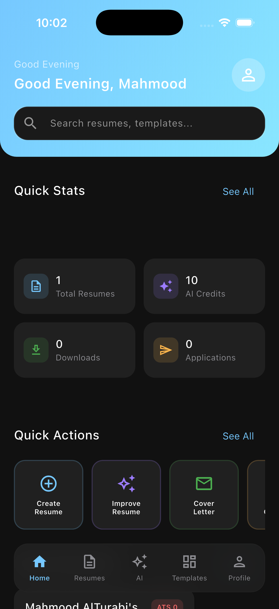
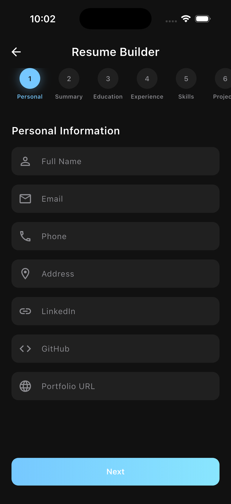
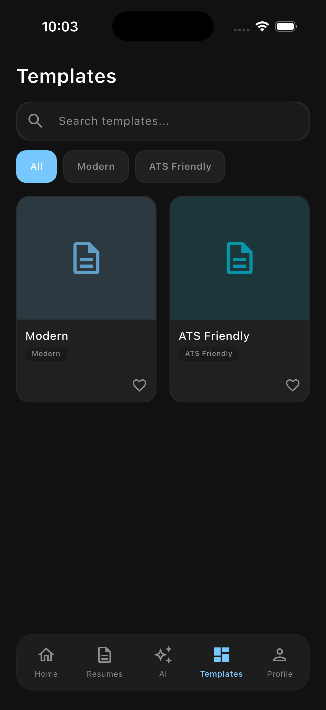
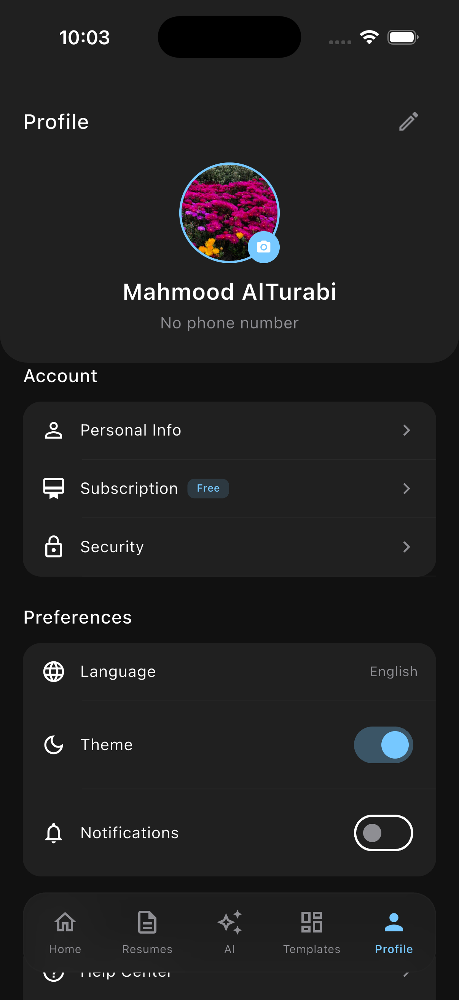
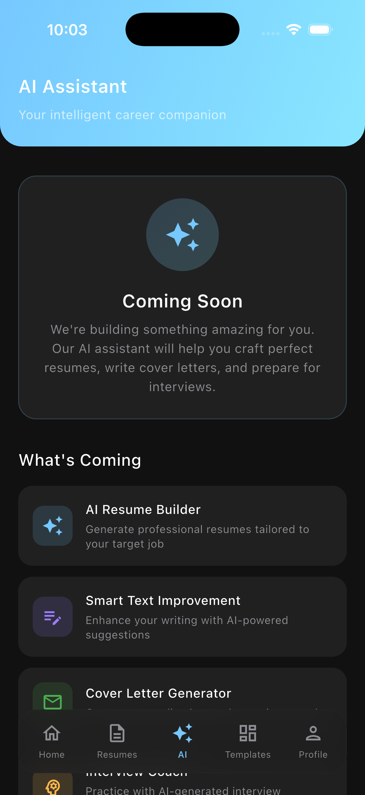

# ResumeAI

AI-powered resume builder Flutter application. Create professional resumes with modern templates, AI-powered insights, and export to PDF.

## Live Site

**https://mahmoodresumemaker.netlify.app**

> **Recommended:** Reduce your browser window to mobile size (375–420px width) for the best experience. This is a mobile-first app designed for smartphone screens.

### Testing Credentials

- **Email:** guest@mahmood2.com
- **Password:** 11223344

## Screenshots

<!-- Add your screenshots here -->

| Dashboard | Resume Builder | Templates |
|-----------|---------------|-----------|
|  |  |  |

| Profile | AI Assistant | Dark Mode |
|---------|-------------|-----------|
|  |  |  |

## Features

### Core
- **Resume Builder** — 9-step wizard with real-time preview (Personal Info, Summary, Education, Experience, Skills, Projects, Certificates, Languages, Preview)
- **PDF Generation** — Export resumes as professional PDFs with multiple template styles
- **Template Selection** — Modern and ATS-friendly templates
- **Edit & Update** — Edit existing resumes with full data pre-population

### AI Features (Coming Soon)
- AI Resume Generator
- Smart Text Improvement
- Cover Letter Generator
- Interview Coach

### User Experience
- **Dark & Light Mode** — Full theme support with persistent preference
- **Glassmorphism UI** — Floating bottom navigation with blur effects
- **Smooth Animations** — Animated transitions and micro-interactions
- **Responsive Design** — Optimized for mobile screens

### Profile & Settings
- Profile image upload (camera/gallery)
- Personal information management
- Subscription tiers (Free, Basic, Premium, Enterprise)
- Security settings (change password, 2FA coming soon)
- FAQs, Privacy Policy, Terms of Service

## Tech Stack

| Layer | Technology |
|-------|------------|
| Framework | Flutter (Dart) |
| State Management | Riverpod |
| Routing | GoRouter |
| Backend | Supabase (Auth, Database, Storage) |
| PDF Generation | pdf + printing packages |
| UI Components | Custom glassmorphism design system |

## Project Structure

```
lib/
├── core/
│   ├── config/          # Supabase config, database schema
│   ├── services/        # PDF service, template generators
│   │   └── templates/   # modern_template.dart, ats_template.dart
│   └── theme/           # AppColors, AppTextStyles, AppTheme
├── models/              # Data models (Resume, Education, Experience, etc.)
├── features/
│   ├── auth/            # Login, Register screens
│   ├── dashboard/       # Home dashboard with stats
│   ├── resume/          # Resume builder, templates, resumes list
│   ├── ai/              # AI Assistant (coming soon)
│   ├── profile/         # Profile, Security, FAQs, Privacy, Terms
│   └── subscription/    # Subscription plans
├── navigation/          # GoRouter config, MainShell with floating nav
└── providers/           # Riverpod providers (Auth, Resume, AI, Theme)
```

## Getting Started

### Prerequisites
- Flutter SDK ^3.12.2
- Supabase account and project

### Setup

1. Clone the repository
   ```bash
   git clone https://github.com/your-username/resume_ai.git
   cd resume_ai
   ```

2. Install dependencies
   ```bash
   flutter pub get
   ```

3. Configure Supabase
   - Create a Supabase project
   - Run the SQL schema from `lib/core/config/database_schema.sql`
   - Update `lib/core/config/supabase_config.dart` with your credentials

4. Run the app
   ```bash
   flutter run
   ```

## Database Schema

The app uses Supabase with the following tables:
- `profiles` — User profiles with subscription tier
- `resumes` — Resume data with JSON fields for sections
- `cover_letters` — Cover letter storage
- `templates` — Resume templates

## Subscription Tiers

| Tier | Price (BHD) | Features |
|------|-------------|----------|
| Free | 0 | Basic resume building |
| Basic | 3/mo | More templates, export options |
| Premium | 7/mo | AI features, all templates |
| Enterprise | 19/mo | Team features, priority support |

## Author

**Matt** — [matmood.netlify.app](https://matmood.netlify.app)

## License

This project is proprietary software.
